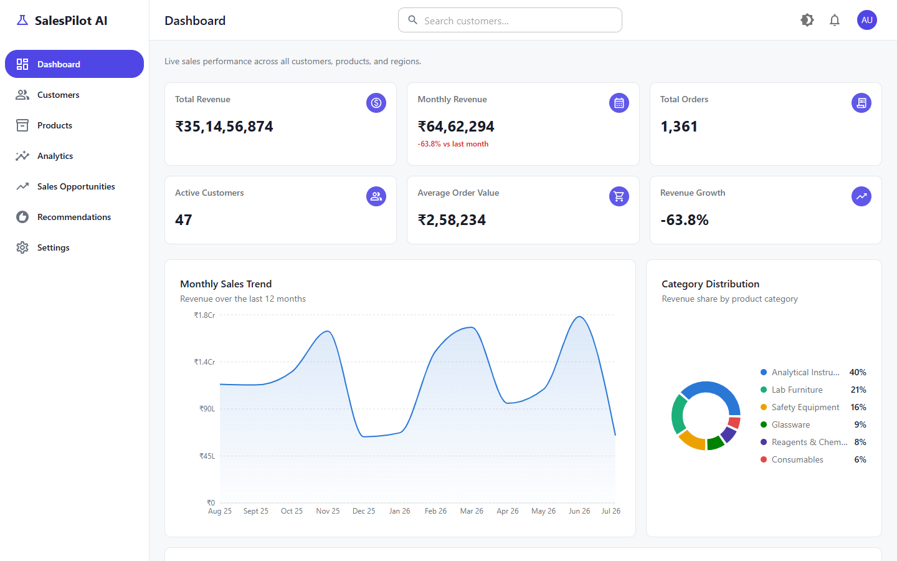
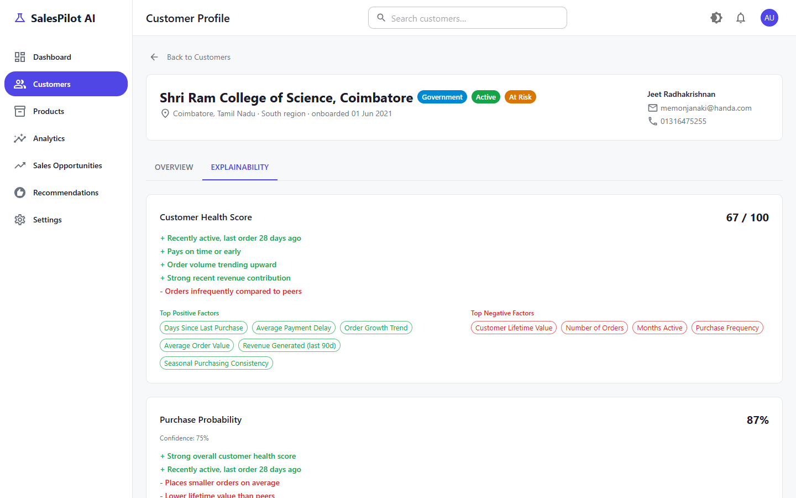
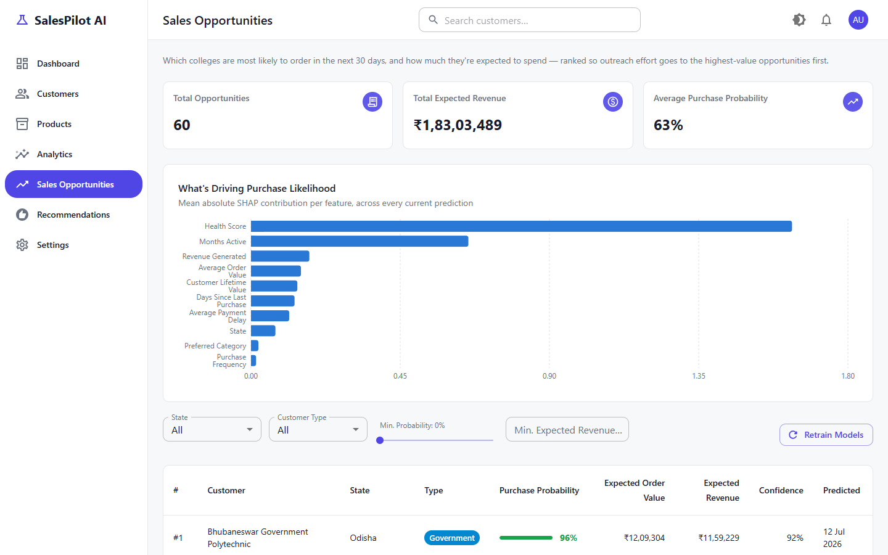
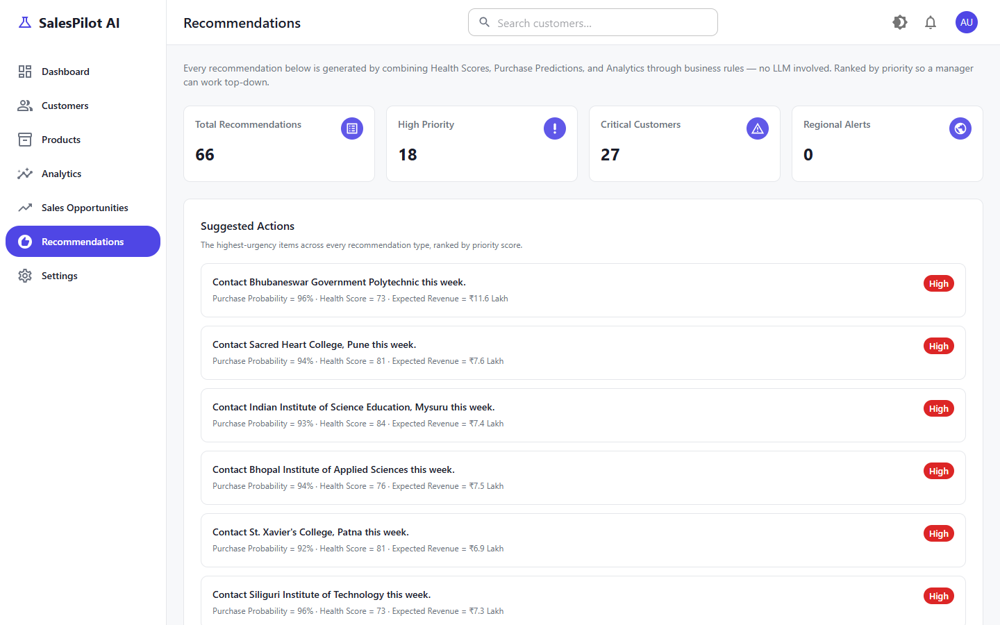
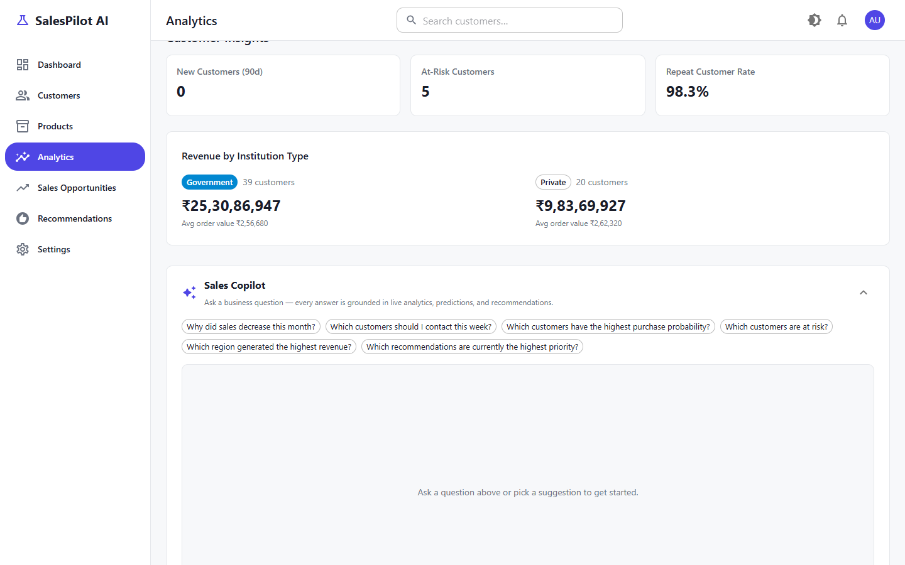
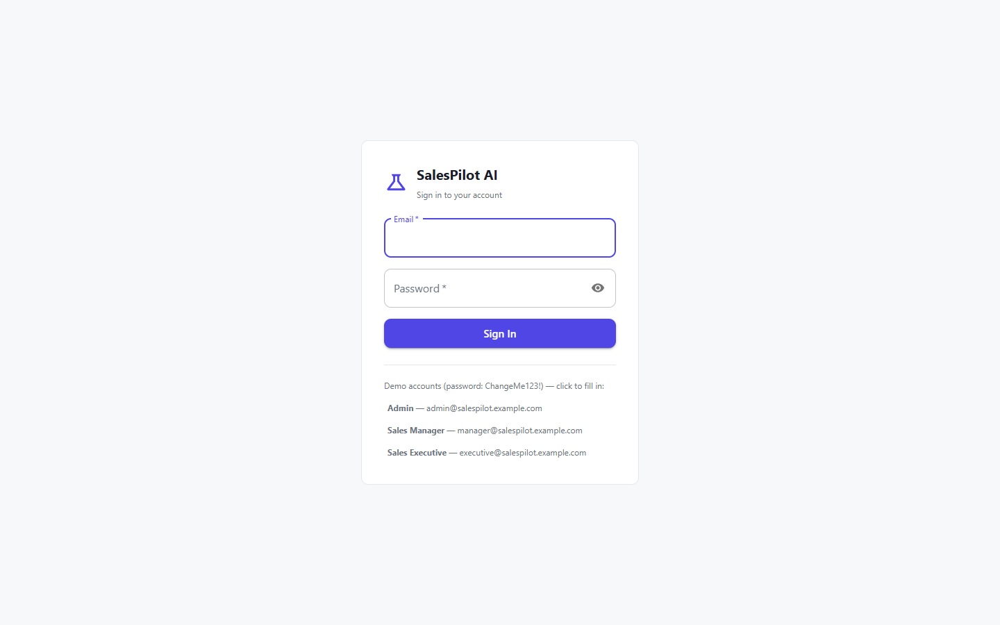

# SalesPilot AI

**An Explainable-AI-powered Sales Intelligence CRM** for a laboratory
equipment company — analytics dashboards, ML-driven purchase predictions
with SHAP explanations, a transparent customer health score, a rule-based
recommendation engine, and an embedded AI Sales Copilot, all behind
role-based authentication.

Built as an 11-milestone project, each one shipped, verified end-to-end,
and reviewed before the next began. See [`PROJECT_SUMMARY.md`](PROJECT_SUMMARY.md)
for the resume-ready summary, or [`docs/MILESTONES.md`](docs/MILESTONES.md)
for the full build history.

---

## Features

- **📊 Analytics Dashboard** — live KPIs, revenue trend, category
  distribution, regional performance, and top customers/products — all
  computed from real orders in Postgres, not static JSON.
- **💚 Customer Health Score** — a transparent, weighted 0-100 score across
  ten factors (recency, payment reliability, growth trend, etc.) —
  deliberately *not* a black-box ML model, so every score comes with its
  full per-factor breakdown by construction.
- **🎯 Purchase Propensity Prediction** — two XGBoost models (purchase
  probability + expected order value) ranking every customer by expected
  revenue, with versioned, never-deleted model artifacts.
- **🔍 Explainable AI (SHAP)** — every prediction and health score comes
  with a plain-English "why": top positive/negative factors, waterfall/
  force/summary plots, and business-friendly reason sentences (e.g.
  *"Payment delayed by 18 days"*) instead of raw SHAP numbers.
- **📋 Business Recommendation Engine** — rule-based (no LLM), turning
  health scores + predictions + revenue trends into ranked "contact this
  customer," "follow up on this risk," "respond to this regional swing"
  actions a sales manager can act on today.
- **🤖 Embedded AI Sales Copilot** — ask "why did sales decrease this
  month?" in plain English, right inside the Analytics page. Grounded
  entirely in this backend's own REST API (never raw SQL, never a vector
  database) and phrased by a free LLM (Groq/OpenRouter/Ollama).
- **🔐 Authentication & RBAC** — JWT-based login, three roles (Admin, Sales
  Manager, Sales Executive), sensitive actions (model retraining, health
  recalculation) restricted accordingly.
- **🏭 Production-ready** — standardized error handling, request-ID
  tracing, response caching, code-split/lazy-loaded frontend, multi-stage
  Docker builds (dev + production targets), and test suites across all
  three projects.

## Screenshots

| Dashboard | Customer Explainability |
|---|---|
|  |  |

| Sales Opportunities (SHAP feature importance) | Recommendations |
|---|---|
|  |  |

| Embedded Sales Copilot | Login |
|---|---|
|  |  |

## Architecture

```
┌────────────────────┐  HTTPS   ┌──────────────────────────────────────────┐
│   React Frontend    │ ───────► │              FastAPI Backend              │
│  (MUI + Recharts)   │ ◄─────── │  REST API · JWT Auth · domain services    │
└────────────────────┘          │  Sales Copilot (intent routing + LLM)     │
                                 └───────┬────────────────────────────────┘
                                         ▼
                             ┌───────────────────────┐        ┌──────────────────────────────┐
                             │      PostgreSQL         │ ◄──── │   Offline ML Pipeline (ml/)    │
                             │  transactional store   │ writes│  features → XGBoost → SHAP     │
                             └───────────────────────┘        └──────────────────────────────┘
```

Four independent projects — `backend/` (FastAPI), `frontend/` (React +
Vite), `ml/` (pandas/XGBoost/SHAP, its own venv), and `docs/` — each with a
single clear responsibility. See [`docs/ARCHITECTURE.md`](docs/ARCHITECTURE.md)
for the full request lifecycle, the Sales Copilot's grounding pipeline, and
the reasoning behind every major design decision.

## Technology Stack

| Layer | Technology |
|---|---|
| Frontend | React 18, TypeScript, Vite, MUI v6, Recharts, React Query, React Router, Axios |
| Backend | FastAPI, SQLAlchemy 2, Pydantic v2, Alembic, PyJWT, bcrypt |
| ML / Explainability | pandas, scikit-learn, XGBoost, SHAP, matplotlib |
| Database | PostgreSQL 16 |
| AI Copilot | Groq / OpenRouter / Ollama (any OpenAI-compatible chat API) |
| Testing | pytest (backend + ml), Vitest + React Testing Library (frontend) |
| Infra | Docker, Docker Compose (multi-stage `dev`/`production` images), nginx |

## Quick Start

```bash
git clone <repo-url>
cd sales_ai_internship_project
cp .env.example .env
docker compose up --build
```

Then, once the containers are up:

```bash
docker compose exec backend alembic upgrade head
docker compose exec backend python -m app.db.seed
docker compose exec backend python -m app.db.seed_users
```

Open **http://localhost:5173** and log in — demo accounts (password
`ChangeMe123!` for all three):

| Role | Email |
|---|---|
| Admin | `admin@salespilot.example.com` |
| Sales Manager | `manager@salespilot.example.com` |
| Sales Executive | `executive@salespilot.example.com` |

Full setup instructions (including running each project natively without
Docker, and enabling the ML pipeline / Sales Copilot) are in
[`docs/SETUP.md`](docs/SETUP.md).

## Usage

- **Dashboard** — start here for a live snapshot of the business.
- **Customers → pick one → Explainability tab** — see exactly why a
  customer's health score and purchase prediction are what they are.
- **Sales Opportunities** — ranked list of who's most likely to buy next,
  and how much; Admin/Sales Manager accounts can trigger a model retrain
  from here.
- **Recommendations** — the day's suggested actions, ranked by priority.
- **Analytics → scroll down** — ask the Sales Copilot a business question
  in plain English.

## Project Structure

```
sales_ai_internship_project/
├── backend/     # FastAPI service — REST API, auth, business-rule engines
├── frontend/    # React + Vite SPA
├── ml/          # offline ML pipeline — feature engineering, training, SHAP
├── docs/        # architecture, deployment, setup, API, developer guides
├── PROJECT_SPEC.md      # the full design spec (source of truth)
└── PROJECT_SUMMARY.md   # resume/interview-ready project summary
```

Full breakdown with every subfolder explained:
[`docs/PROJECT_STRUCTURE.md`](docs/PROJECT_STRUCTURE.md).

## Documentation

| Doc | Covers |
|---|---|
| [`PROJECT_SPEC.md`](PROJECT_SPEC.md) | Full architecture, database schema, API design, and the reasoning behind every milestone's decisions |
| [`PROJECT_SUMMARY.md`](PROJECT_SUMMARY.md) | Resume description, interview talking points, business impact |
| [`docs/ARCHITECTURE.md`](docs/ARCHITECTURE.md) | System design, request lifecycle, Sales Copilot pipeline, caching, testing strategy |
| [`docs/SETUP.md`](docs/SETUP.md) | Full local setup (Docker and native), verification, troubleshooting |
| [`docs/DEPLOYMENT.md`](docs/DEPLOYMENT.md) | Production deployment with `docker-compose.prod.yml` |
| [`docs/ENVIRONMENT_VARIABLES.md`](docs/ENVIRONMENT_VARIABLES.md) | Every env var, what it does, and its default |
| [`docs/API.md`](docs/API.md) | API reference map (points to the live Swagger UI at `/docs`) |
| [`docs/DEVELOPER_GUIDE.md`](docs/DEVELOPER_GUIDE.md) | Conventions, testing, common gotchas for contributors |
| [`docs/PROJECT_STRUCTURE.md`](docs/PROJECT_STRUCTURE.md) | Every folder, explained |
| [`docs/MILESTONES.md`](docs/MILESTONES.md) | The full milestone-by-milestone build history |

## Testing

```bash
cd backend && pytest -q          # 53 tests
cd frontend && npm test          # 27 tests
cd ml && pytest -q               # 27 tests
```

## Future Enhancements

Not built, deliberately out of scope for this project (see
`PROJECT_SPEC.md §11` for the full list and reasoning):

- Write-side CRUD (create/update/delete colleges, products, orders) and CSV import
- A scheduled insights feed and product-level cross-sell suggestions
- A background job queue (Celery + Redis) for retraining, instead of a synchronous subprocess call
- Redis-backed caching once the backend runs as more than one replica
- Rate limiting on `/copilot/chat` and `/auth/login`
- A dedicated `ml/` container/service, decoupling retraining from a shared filesystem path

## License

This is an internship/portfolio project. No license has been chosen yet —
treat it as "all rights reserved" unless the repository owner adds one.
